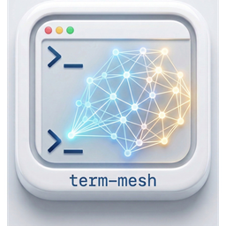

<p align="center">
  
</p>

<h1 align="center">term-mesh</h1>

<p align="center">
  <strong>AI Agent Control Plane for macOS</strong>
</p>

<p align="center">
  Run multiple AI coding agents in parallel with sandboxed worktrees, real-time resource monitoring, and a unified dashboard — all powered by a native GPU-accelerated terminal.
</p>

<p align="center">
  <a href="https://term-mesh.dev">Website</a> &middot;
  <a href="https://github.com/JINWOO-J/term-mesh/releases/latest">Download</a> &middot;
  <a href="#features">Features</a> &middot;
  <a href="#quick-start">Quick Start</a>
</p>

<p align="center">
  <a href="https://github.com/JINWOO-J/term-mesh/releases/latest"></a>
</p>

---

<p align="center">
  
</p>

## Features

### Sandbox Worktree Orchestration
Agents get physically isolated `git worktree` environments. Each agent session runs in its own directory, preventing accidental modifications to the main repository. Worktrees are automatically cleaned up when tabs close.

### Multi-Agent Native Terminal
Built on [Ghostty](https://ghostty.org) (libghostty) for Metal GPU-accelerated terminal rendering. Vertical sidebar tabs show git branch, working directory, and notification status for each agent session.

<p align="center">
  
</p>

### Notification Rings
Visual notification rings on sidebar tabs alert you when agents need attention — completed tasks, errors, or prompts waiting for input.

<p align="center">
  
</p>

### Built-in Browser
Open web pages, documentation, or dashboards directly in a split panel without leaving the terminal.

<p align="center">
  
</p>

### Budget Guard & Resource Monitoring
- **CPU/Memory monitoring** with automatic process discovery
- **SIGSTOP/SIGCONT** process control when thresholds are exceeded
- **Real API cost tracking** by parsing Claude Code's JSONL logs with incremental reads
- Model-specific pricing: Opus $5/$25, Sonnet $3/$15, Haiku $1/$5 per MTok

### File Access Heatmap
FSEvents-based file watcher tracks create/modify/remove events across watched directories. The dashboard renders a heatmap with top-10 hot files, recent events, and per-minute timeline buckets.

### Real-time Dashboard
Monitoring dashboard available as a **split panel** in-app (Cmd+Shift+D) or **standalone browser** at `http://localhost:9876`.

### Socket API
Full control via Unix socket and HTTP REST API — automate tab creation, pane management, notifications, and more from scripts or other tools.

## Architecture

```
┌──────────────────────────────────────────────────────────┐
│                   term-mesh (macOS App)                   │
│                                                          │
│  ┌─────────────────┐  ┌──────────────────────────────┐  │
│  │  Native Shell   │  │     Dashboard (WKWebView)    │  │
│  │  Swift + AppKit  │  │     Chart.js + HTTP Poll     │  │
│  │                 │  │     http://localhost:9876     │  │
│  │  Vertical Tabs  │  │                              │  │
│  │  Split Panes    │  │  ┌────────┐ ┌────────────┐  │  │
│  │  Notifications  │  │  │CPU/Mem │ │ File       │  │  │
│  │                 │  │  │Monitor │ │ Heatmap    │  │  │
│  ├─────────────────┤  │  ├────────┤ ├────────────┤  │  │
│  │ Terminal Engine  │  │  │API Cost│ │ Agent      │  │  │
│  │ libghostty      │  │  │Tracker │ │ Status     │  │  │
│  │ (Metal GPU)     │  │  └────────┘ └────────────┘  │  │
│  └─────────────────┘  └──────────────────────────────┘  │
│          │                         │                     │
│          │    Unix Socket / HTTP   │                     │
│          └───────────┬─────────────┘                     │
│                      ▼                                   │
│  ┌──────────────────────────────────────────────────┐   │
│  │              term-meshd (Rust Daemon)             │   │
│  │                                                    │   │
│  │  Worktree (git2)  │  Monitor (sysinfo)            │   │
│  │  Watcher (notify)  │  Usage (JSONL parsing)        │   │
│  │  Budget Guard (SIGSTOP/SIGCONT)                    │   │
│  └──────────────────────────────────────────────────┘   │
└──────────────────────────────────────────────────────────┘
```

## Prerequisites

| Component | Version | Notes |
|-----------|---------|-------|
| macOS | 13 Ventura+ | Metal 2 required |
| Xcode | 15+ | Swift 5.9+ |
| Rust | stable 1.75+ | edition 2021 |
| Zig | 0.15+ | For libghostty build |

## Quick Start

```bash
# 1. Clone and setup
git clone https://github.com/JINWOO-J/term-mesh.git && cd term-mesh

# 2. Build libghostty + native app
./scripts/setup.sh
./scripts/reload.sh --tag dev

# 3. Run daemon only (for development)
cd daemon && cargo run --bin term-meshd
```

## CLI Usage

The `term-mesh` CLI provides a PTY wrapper for running commands under the control plane:

```bash
# Run Claude Code in a PTY wrapper
term-mesh run claude code

# Run any command
term-mesh run -- kiro-cli chat "fix this bug"

# Show help
term-mesh help
```

Install location: `~/bin/term-mesh`

## API Reference

### HTTP REST API (port 9876)

| Method | Endpoint | Description |
|--------|----------|-------------|
| GET | `/api/monitor` | System + process snapshots, budget config, usage summary |
| GET | `/api/sessions` | Terminal sessions from the Swift app |
| GET | `/api/watcher` | File heatmap snapshot (top files, events, timeline) |
| GET | `/api/usage` | Per-session API cost and token usage |
| POST | `/api/process/stop` | SIGSTOP a process `{"pid": 1234}` |
| POST | `/api/process/resume` | SIGCONT a process `{"pid": 1234}` |
| POST | `/api/budget/auto-stop` | Toggle auto-stop `{"enabled": true}` |
| POST | `/api/watcher/watch` | Start watching a path `{"path": "/..."}` |
| POST | `/api/watcher/unwatch` | Stop watching a path `{"path": "/..."}` |

### JSON-RPC 2.0 (Unix Socket)

Socket path: `$TMPDIR/term-meshd.sock`

| Method | Description |
|--------|-------------|
| `ping` | Health check (returns `"pong"`) |
| `worktree.create` | Create a sandboxed worktree |
| `worktree.remove` | Remove a worktree by name |
| `worktree.list` | List all term-mesh worktrees |
| `monitor.snapshot` | Get system/process resource snapshot |
| `monitor.track` | Track a PID for monitoring |
| `monitor.untrack` | Stop tracking a PID |
| `process.stop` | Send SIGSTOP to a process |
| `process.resume` | Send SIGCONT to a process |
| `budget.auto_stop` | Enable/disable auto-stop |
| `watcher.watch` | Watch a filesystem path |
| `watcher.unwatch` | Unwatch a filesystem path |
| `watcher.snapshot` | Get heatmap snapshot |
| `usage.snapshot` | Get API cost/token snapshot |
| `session.sync` | Push session list from Swift app |
| `session.list` | List terminal sessions |

## Project Structure

```
daemon/
  term-meshd/src/
    main.rs          # Daemon entry point
    socket.rs        # Unix Socket JSON-RPC server
    http.rs          # HTTP/REST API server (axum)
    monitor.rs       # CPU/memory monitoring + Budget Guard
    tokens.rs        # JSONL usage tracking + cost calculation
    watcher.rs       # FSEvents file heatmap
    worktree.rs      # Git worktree orchestration
  term-mesh-cli/src/
    main.rs          # CLI entry point
    pty.rs           # PTY wrapper
Sources/
  DashboardController.swift   # WKWebView dashboard + PID tracking
  TermMeshDaemon.swift         # Swift RPC client
Resources/
  dashboard/index.html         # Dashboard UI (Chart.js)
scripts/
  setup.sh                     # Initial build setup
  reload.sh                    # Rebuild and reload
```

## Build & Test

```bash
# Run all Rust tests
cd daemon && cargo test

# Run daemon in development mode
cd daemon && cargo run --bin term-meshd

# Performance benchmarks (requires running daemon + socat)
bash daemon/scripts/bench.sh
```

## License

This project is licensed under the [GNU Affero General Public License v3.0 or later](LICENSE) (`AGPL-3.0-or-later`).

Built on [Ghostty](https://ghostty.org) by Mitchell Hashimoto.
